# Deep Motion Modeling Tracker

We propose a **D**eep **M**otion **M**odeling **N**etwork (**DMM-Net**) for object localization from the spatial-temporal dimension in an end-to-end fashion. The proposed **DMM-Net** can learn compact, yet comprehensive features of a set of video frames to infer the motion parameters of multiple objects. Besides it can also estimate all possible objects' categories and visibilities. After that, we deploy this network into the proposed Deep Motion Modeling Tracker (**DMMT**). This tracker can achieve **the fastest speed (120 fps)** and a promising performance in comparison with state-of-the-arts.

## RoadMap

| Date   | Event                                                        |
| ------ | ------------------------------------------------------------ |
| 201911 | Finish the papers :-)                                        |
| 201910 | Preparing papers                                             |
| 201908 | Get Result on AMOT dataset                                   |
| 201908 | Can Train on AMOT dataset                                    |
| 201907 | Can Train on MOT17 dataset                                   |
| 201906 | Can Train on ``[CVPR 2019 Tracking Challenge](<https://motchallenge.net/data/CVPR_2019_Tracking_Challenge/#download>)'' |
| 201905 | Can Train On the Whole UA-DETRAC dataset                     |
| 201905 | Design the tracker                                           |
| 201904 | Recording Five Cities Training Dataset                       |
| 201903 | Start A Plan of Create New Dataset                           |
| 201902 | Optimized this network                                       |
| 201812 | Can Do the Basic Detection                                   |
| 201811 | Design the Loss Fucntion                                     |
| 201810 | Try the UA-DETRAC dataset                                    |
| 201809 | Re-design the input and output                               |
| 201808 | Design the whole network                                     |
| 201807 | Start this idea                                              |

## Protocol

-  respectively denote the number of input frames, object categories (0 for `background'), time-related motion parameters, and anchor tunnels.
-  are the frame width, and frame height.
-  denotes the video frame at time . Subsequently, a 4-D tensor  denotes  video frames from time  to . For simplicity, we often ignore the subscript ``''.
-  respectively denote the ground truth boxes, categories, and visibilities in the selected  video frames from time  to . The text also ignores ``'' for these notations.
-  denote the estimated motion parameters, categories, and visibilities. With time stamps and frames clear from the context, we simplify these notations as .

## DMM-Net

To absolve deep learning based tracking-by-detection from relying on off-the-shelf detectors, we propose **D**eep **M**otion **M**odeling **N**etwork (**DMM-Net**) for on-line MOT, shown in Figure 1. Our network enables MOT by jointly performing object detection, tracking, and categorization across multiple video frames without requiring pre-detections and subsequent data association. For the given input video, it outputs objects' motion parameters, categories, and their visibilities across the input frames.


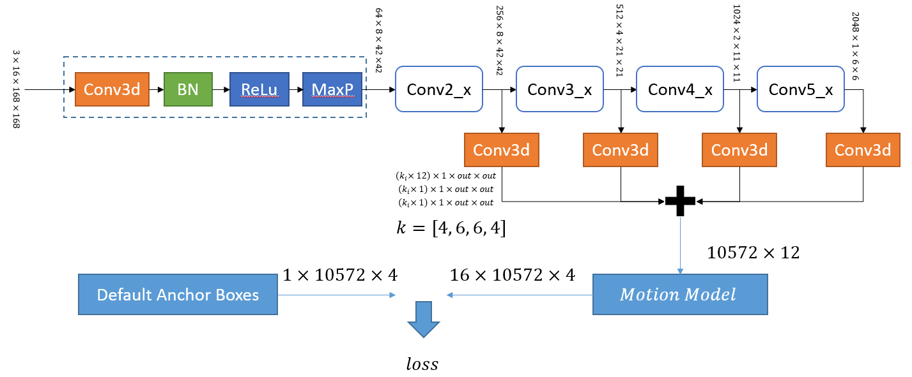

## DMM Tracker

We directly deploy the trained network into the **DMM Tracker** (**DMMT**), as shown in the following figure.   frames are processed by the tracker, where the trained DMM-Net selects  frames as its input, and outputs predicted tunnels containing all possible object's motion parameter matrice , category matrice  and visibility matrice , which are then filtered by the Tunnel Filter. After that, the track set  is updated by associating the filtered tunnels by their IOU with previous track set .

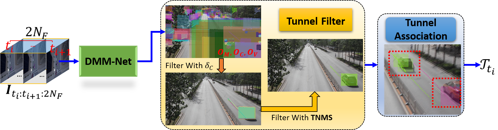

> This tracker can achieve more than **120** fps for jointly detection and tracking.


## Requirement
| Name   | Version |
| ------ | ------- |
| Python | 3.6     |
| CUDA   | 80.0+   |
|        |         |

Besides, install all the python package by following command

```shell
cd <project path>
pip install -r requiement.txt
```

## Preparation
- Clone this repository

  ```shell
  git clone <repository url>
  ```

- Download the [pre-trained base net model](https://drive.google.com/open?id=1CYb-RBZpz3UTbQRM4oIRipZrWrq10iIQ), and save it into *<project>/weights/resnext-101-64f-kinetics.pth*

## OMOTD

- Download the training dataset and testing dataset from [[baidu]<code: ncdd>](https://pan.baidu.com/s/13sjHN0pvU8U75oY0MDLLGg) or [[dropbox]]()

### Test

- Download the network weights file ([[dropbox]](https://www.dropbox.com/s/v050d0fvgj41nkx/ssdt67650.pth?dl=0), [[baidu]<code: 8f33>](https://pan.baidu.com/s/1G5LAWz_TeUVl45rzzG4bdg))

- Modify the *<project path>/config/\_\_init\_\_.py* to

  ```python
  15. # configure_name = 'config_gpu4_ua.json'
  16. # configure_name = 'config_gpu4_ua_test.json'
  17. # configure_name = 'config_gpu4_ua_with_amot.json'
  18. configure_name = 'config_gpu4_amot.json'
  ```

- Modify the *<project path>/config/config_gpu4_amot.json*

  ```python
  1.    {
  2.       "dataset_name": "AMOTD",
  3.       "dataset_path": <your downloaded omotd folder>,
  4.		 "phase": "test",    
      ...
  24.			"test": {
  25.				"resume": <your downloaded weights>,
  26.			    "dataset_type": <you can use "train" or "test">,    
      ...
  30.    			"base_net_weights": null,
  31.    			"log_save_folder": <your log save folder>,
  32.			    "image_save_folder": <your image save folder>,
  33.			    "weights_save_folder": <your weights save folder>,    
  ```

- Activate your python environment, and run

  ```shell
  cd <project folder>
  python test_tracker_amotd.py
  ```

### Train

- Modify the *<project path>/config/\_\_init\_\_.py* to

  ```python
  15. # configure_name = 'config_gpu4_ua.json'
  16. # configure_name = 'config_gpu4_ua_test.json'
  17. # configure_name = 'config_gpu4_ua_with_amot.json'
  18. configure_name = 'config_gpu4_amot.json'
  ```

- Modify the *<project path>/config/config_gpu4_amot.json*

  ```python
  1.	{
  2.		"dataset_name": "AMOTD",
  3.	  	"dataset_path": <your downloaded omotd folder>,
      ...
  4.		"phase": "train",    
      ...
  64. 	"train": {    
  65.    		"resume": null,
  66.    		"batch_size": 8 <you can change it according to your gpu capability>,
      ...
  71.			"log_save_folder": <your log save folder>,
  72.		    "image_save_folder": <your image save folder>,
  73.		    "weights_save_folder": <your weights save folder>,    
      ...    
  ```

- Activate your python environment, and run

  ```shell
  cd <project folder>
  python train_amot.py
  ```

## UA-DETRAC

- Download the training and testing dataset from [[UA-DETRAC Official Site]](https://detrac-db.rit.albany.edu/) or [[baidu]<code: cne2>](https://pan.baidu.com/s/1QZZGLarNg-AtvSlMSmWMyA)

### Test

- Download the network weights file([[dropbox]](https://www.dropbox.com/s/25ao070zfx8jq9o/ssdt193895.pth?dl=0), [[baidu]<code:zimh>](https://pan.baidu.com/s/160KQdotufH-N6fuUoZ-4Zw))

- Modify the *<project path>/config/\_\_init\_\_.py* to

  ```python
  15. configure_name = 'config_gpu4_ua.json'
  16. # configure_name = 'config_gpu4_ua_test.json'
  17. # configure_name = 'config_gpu4_ua_with_amot.json'
  18. # configure_name = 'config_gpu4_amot.json'
  ```

- Modify the *<project path>/config/config_gpu4_ua.json*

  ```python
  1. {
  2.   "dataset_name": "UA-DETRAC",
  3.   "dataset_path": <the UA-DETRAC dataset folder>,
  4.   "phase": "test",
      ...
  36.  "test": {
  37.    "resume": <network weights file>,
  38.    "dataset_type": "test",    
      ...
  42.    "base_net_weights": null,
  43.    "log_save_folder": <your log save folder>,
  44.    "image_save_folder": <your image save folder>,
  45.    "weights_save_folder": <your network weights save folder>,    
  ```

- Activate your python environment, and run

  ```shell
  cd <project folder>
  python test_tracker_ua.py
  ```

### Train

- Modify the *<project path>/config/\_\_init\_\_.py* to

  ```python
  15. configure_name = 'config_gpu4_ua.json'
  16. # configure_name = 'config_gpu4_ua_test.json'
  17. # configure_name = 'config_gpu4_ua_with_amot.json'
  18. # configure_name = 'config_gpu4_amot.json'
  ```

- Modify the *<project path>/config/config_gpu4_ua.json*

  ```python
  1. {
  2.   "dataset_name": "UA-DETRAC",
  3.   "dataset_path": <the UA-DETRAC dataset folder>,
  4.   "phase": "train", 
      ...
  81.		"log_save_folder": <your log save folder>,
  82.     "image_save_folder": <your image save folder>,
  83.     "weights_save_folder": <your network weights save folder>,
  ```

- activate your python environment, and run

  ```shell
  cd <project folder>
  python train_ua.py
  ```

## Citation

We're going to publish our paper.

## Acknowledge

This work is inspired by the [SSD](https://github.com/amdegroot/ssd.pytorch) and [DAN](https://www.researchgate.net/publication/334508412_Deep_Affinity_Network_for_Multiple_Object_Tracking)

## License

The methods provided on this page are published under the [Creative Commons Attribution-NonCommercial-ShareAlike 3.0 License](http://creativecommons.org/licenses/by-nc-sa/3.0/) . This means that you must attribute the work in the manner specified by the authors, you may not use this work for commercial purposes and if you alter, transform, or build upon this work, you may distribute the resulting work only under the same license. If you are interested in commercial usage you can contact us for further options.

## Cool Demos


## Issues

|   Symbol  | Meanings   |
| :-------: | :--------: |
| :hourglass_flowing_sand:      | Plan to solve         |
| :repeat:                      | try to solve it again |
| :no_entry:                    | abandoned issue       |
| :ballot_box_with_check:       | solved                |
| :black_square_button:         | unsolved              |
| :negative_squared_cross_mark: | cannot get solved     |
| :boom:                        | focusing              |
| :exclamation:                 | important             |

|   SartDate|                            Content                            | State |
| :------:  | :----------------------------------------------------------: | :---: |
| 2019/05/18 |  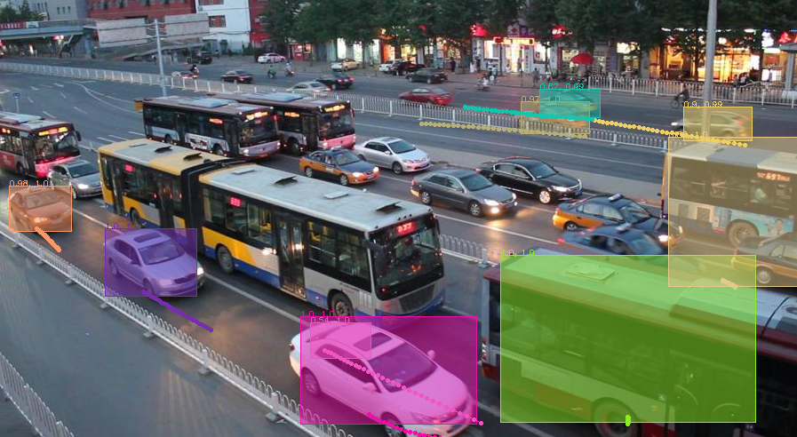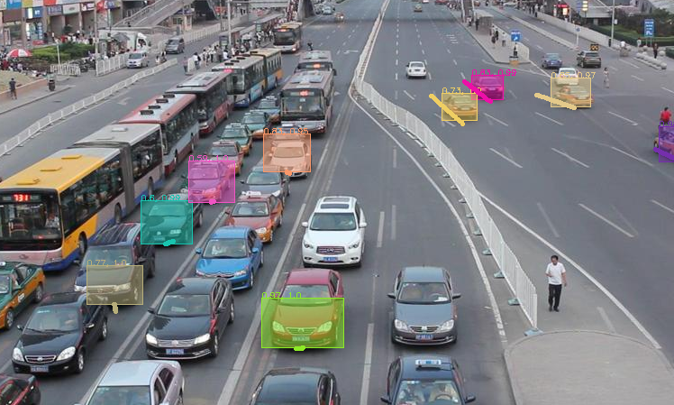 | :ballot_box_with_check: Cannot detect static vehicle (because of the training dataset)|
| 2019/05/18 | 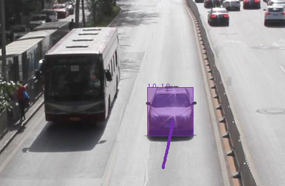 | :ballot_box_with_check: cannot detect bus （because of the training dataset) |
| 2019/05/18 | 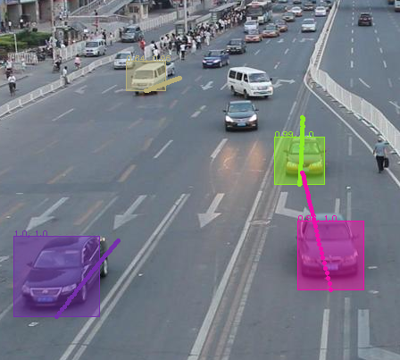 | :ballot_box_with_check: Limit on the detection regions |
| 2019/05/18 | 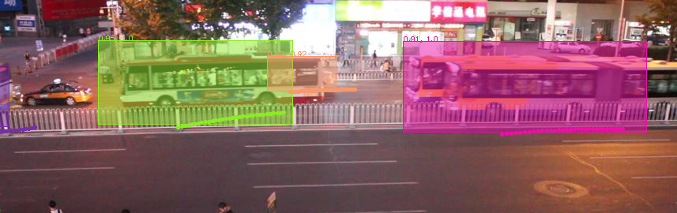 | :ballot_box_with_check: Something overlapped in the bus |
| 2019/05/18 | 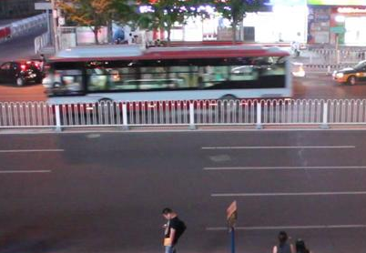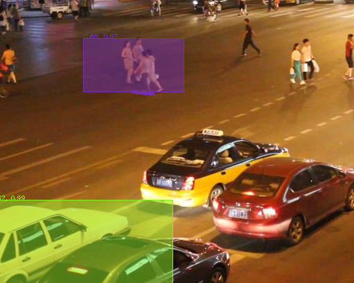 | :boom: totally different scene |
| 2019/05/18 | 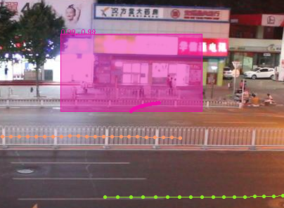 | :ballot_box_with_check: Some weird boxes (because of the visibility)|
| 2019/05/18 | 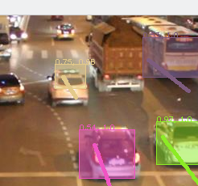 | :ballot_box_with_check: totally different vehicle |
| 2019/05/18 | 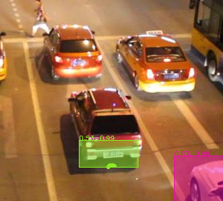 | :ballot_box_with_check: Wrongly located boxes |
| 2019/05/15 | 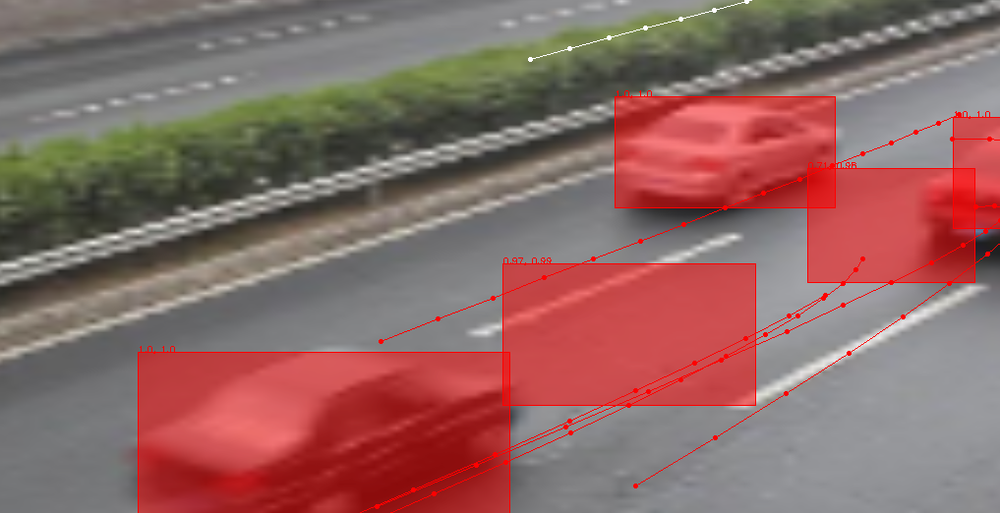 | :ballot_box_with_check: solved by change the loss according the first exist box <br />:boom: Weird rectangles and incorrect classifications |
| 2019/05/07 | None-filling rectangles <br />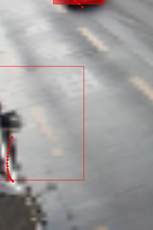 | :ballot_box_with_check: waiting <br />:boom:2019/05/07 process |
| 2019/05/07 | Weird rectangles without label <br />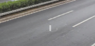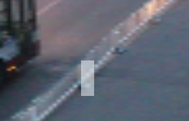 | :ballot_box_with_check: find the reason <br />:boom:2019/05/07 process |
| 2019/05/07 | Lost some objects in other scene <br />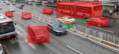 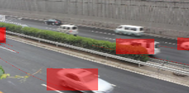 | :ballot_box_with_check:finish by reconfigure the anchor boxes<br />:boom:2019/05/07 process |
| 2019/04/26 | Try MOT 17 | :ballot_box_with_check: Need to do (Finish) |
| 2019/04/26 | Train A-MOT Dataset | :ballot_box_with_check: Need to do (Finish) |
| 2019/04/26 | Train UA-DETRAC | :ballot_box_with_check: Training (Finish)|
| 2019/04/16 | Clean this project | :boom: Ready to do<br>:hourglass_flowing_sand: |
| 2019/04/16 | Overlap ratio of **Tunnel Anchor** too small | :ballot_box_with_check: Find the best overlap ratio​<br>:boom:<br>:hourglass_flowing_sand: |
| 2019/04/16 | Add **Random Mirror** Preprocessing | :no_entry:<br>:hourglass_flowing_sand: |
| 2019/04/16 | Add **Random Crop** Preprocessing | :no_entry:<br>:hourglass_flowing_sand: |
| 2019/04/16 | Needs Testing The Network | :ballot_box_with_check:Thoroughly testing see [result video](<https://www.dropbox.com/s/m63g9jotgs35xu5/1.avi?dl=0>)<br>:boom: 2019/04/16 processing |
| 2019/04/14 | Motion Model Needs Rewrite | :exclamation::exclamation::ballot_box_with_check: 2019/04/16 Rewriting motion model :)​<br>:boom: 2019/04/14 rewriting |
| 2019/04/13  | Lost some objects<br/> 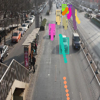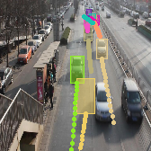<br> |  :ballot_box_with_check: set confidence and existing threshold<br> :boom:20​19/04/13 process  |
| 2019/04/13  | NMS doesn't work well <br>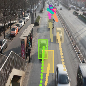 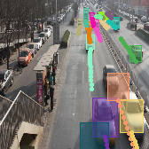<br> | :ballot_box_with_check: ​the bad training data<br>2019/04/13 :boom: |
| 2019/04/13  | Problems of object at the edge of the frames. <br> 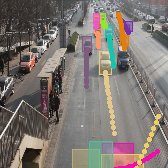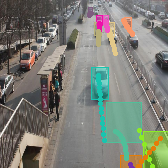 |   :ballot_box_with_check: ​remove edging boxes from training data<br>  2019/04/13 :boom:   |
| 2019/04/13  | Weird detected objects.<br> 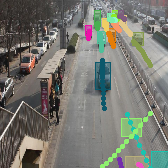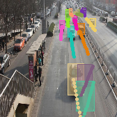 |   :ballot_box_with_check: ​the motion model <br>2019/04/13 :boom:   |

> In our experiment, we find the missing bounding box is caused by the following code:
>
> ```python
> conf[mean_best_truth_overlap < threshold] = 0  # label as background
> ```
>
> Be careful to set this threshold.
